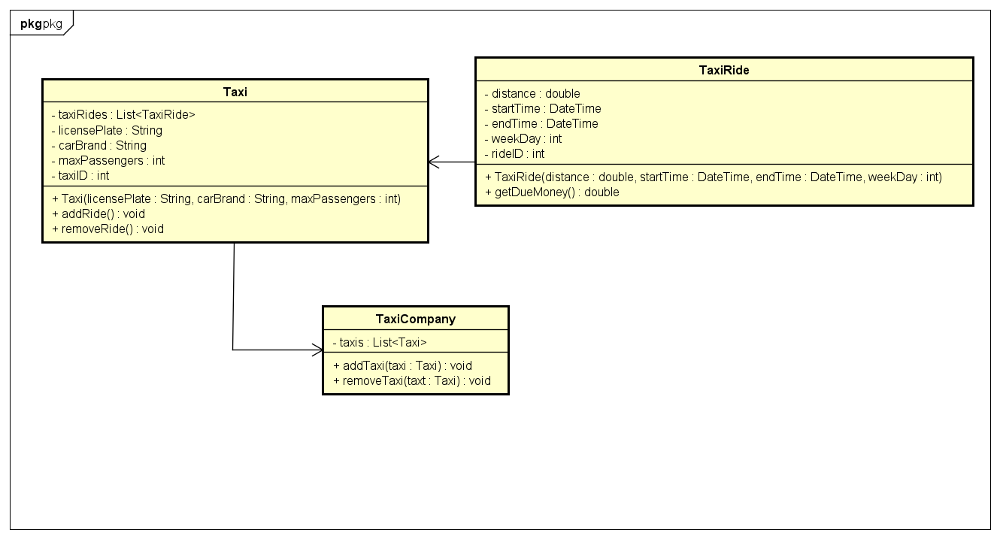
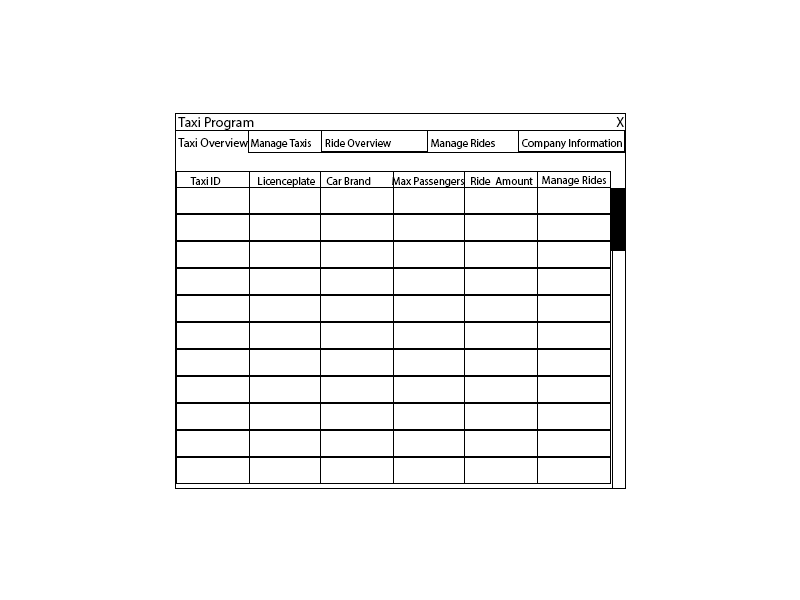
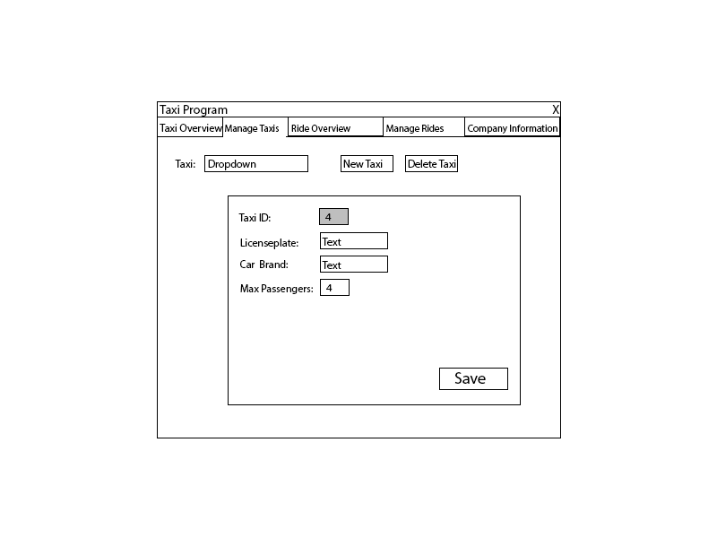
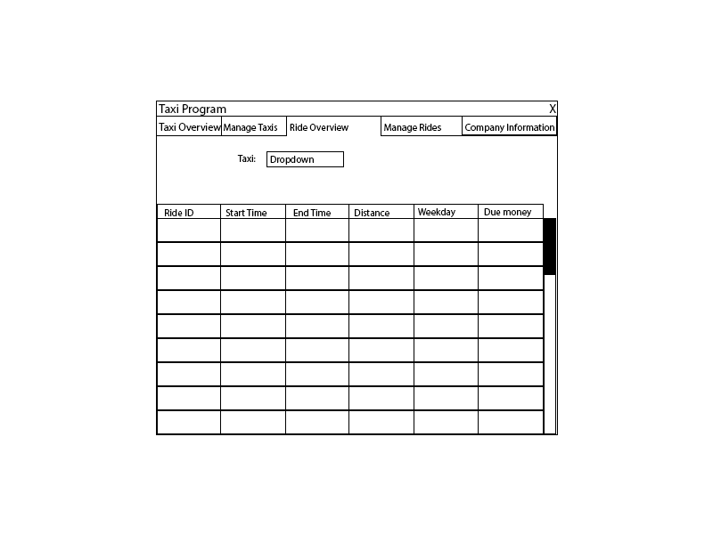
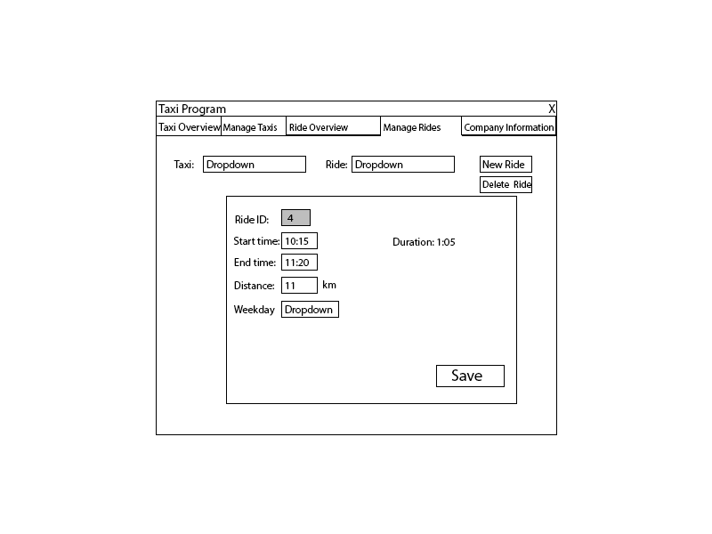
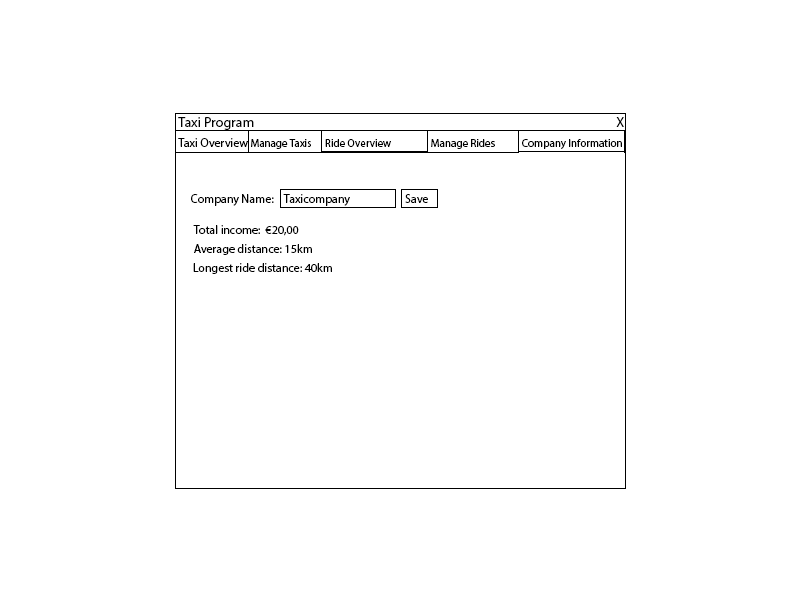

# Startdocument for the Taxi assignment

Startdocument of **Rick Vinke**. Student number **5035678**.

## Problem Description
A taxi company wants an application where the start and end time (formatted as hhmm),
weekday and distance can be entered.
For each trip, the amount of due money should be calculated and shown.
Furthermore, the total revenue, the average distance and the distance of the longest
trip should be shown.

The following tariffs should be maintained:
- € 0,50 per km ridden. 
- On top of the above: € 0,17 per minute ridden.
- From Friday night 10 p.m. to Monday morning 7 a.m., 
a surcharge of 15% applies. (the starting time is decisive for this)

### Input & Output

In this section the in- and output of the application will be described.

#### Input

In the table below all the input (that the user has to input in order to make the application work) are described.

| Case           | Type       | Conditions                                                                                   |
|----------------|------------|----------------------------------------------------------------------------------------------|
| License plate  | `String`   | Cannot be empty. This value must be a valid formatted license plate.                     |
| Car Brand      | `String`   | Cannot be empty.                                                                         |
| Max Passengers | `Integer`  | Cannot be empty. Cannot be less than 0.                                                  |
| Start Time     | `DateTime` | Cannot be empty. Only hours and minutes are changeable.                                  |
| End Time  | `DateTime` | Cannot be empty. Only hours and minutes are changeable. Cannot be before begin time. |
| Weekday        | `Enum`     | Cannot be empty.                                                                         |
| Distance       | `Double`   | Cannot be empty. Cannot be less than 0. Value must be in kilometers.                 |
| Company Name   | `String`   | Cannot be empty.                                                                             |

#### Output

| Case                  | Type      | Description                                                                                                                                        |
|-----------------------|-----------|----------------------------------------------------------------------------------------------------------------------------------------------------|
| Taxi ID               | `Integer` | The ID of the Taxi. Can be used to identify the Taxi.                                                                                              |
| Licenseplate          | `String`  | The license plate of the Taxi. Can be used to identidy which specific car the Taxi info is referring to. Is used in dropdowns to select a Taxi. |
| Car Brand             | `String`  | The brand of the car.                                                                                                                              |
| Max Passengers        | `Integer` | The max amount of passengers that can be in the Taxi.                                                                                              |
| Ride Amount           | `Integer` | The amount of rides the Taxi currently has.                                                                                                        |
| Ride ID               | `String`  | The ID of the TaxiRide. Can be used to identify the Ride.                                                                                          |
| Start Time            | `String`  | The start time of the Ride. Is shown as a String.                                                                                               |
| End Time              | `String`  | The end time of the Ride. Is shown as a String.                                                                                                 |
| Distance              | `Double`  | The distance of the ride, shows in kilometers.                                                                                                     |
| Weekday               | `String`  | The weekday of the Ride.                                                                                                                           |
| Due Money             | `Double`  | The money that still needs to be paid.                                                                                                             |
| Average distance      | `Double`  | The average distance of all Taxi's of the TaxiCompany.                                                                                             |
| Longest ride distance | `Double`  | The longest distance of all the rides of the Taxi's of the TaxiCompany.                                                                            |
| Duration | `String` |  The difference between the start and end time Is shown to get a better overview of the ride time. |

#### Calculations

| Case                  | Calculation                                                                                                              |
|-----------------------|--------------------------------------------------------------------------------------------------------------------------|
| Due money             | The money based on the begin and start time and the distance based on the tariffs in the first section of this document. |
| Average distance      | The average of the distances of all Taxi objects in the Taxi list.                                                       |
| Longest ride distance | Loop over all the Taxi objects and then the Ride objects of those Taxis to find the ride with the longest distance.      |
| Duration | The difference between the start time and end time.                                                                      |

## Class Diagram

## GUI drawing

## Testplan

### Testdata
#### Taxi

| Type          | Data     |
|---------------|----------|
| License plate | 75-DN-GP |
| Car Brand | Ford     |
|Max Passengers | 3        |

#### TaxiRide

| Type       | Data    |
|------------|---------|
| Start time | 10:15   |
| End time   | 11:20   |
| Distance   | 11      |
| Weekday    | Tuesday |

#### TaxiCompany

| Type       | Data    |
|------------|---------|
| CompanyName | NHL Stenden |

In this section the testcases will be described to test the application.
At the start of this testplan there should be no existing data in the database.

#### #1 Test Taxi creation.

Testing if the creation of Taxis and the input validation of the form is working correctly.

| Step | Input                                                                                   | Action                                                                                  | Expected output                                       |
|------|-----------------------------------------------------------------------------------------|-----------------------------------------------------------------------------------------|-------------------------------------------------------|
| 1    |                                                                                         | Check Taxi overview                                                                     | No entries in the table.                              |
| 2    |                                                                                         | Go to 'Manage Taxis'.                                                                   | The Manage Taxi menu.                                 |
| 3    |                                                                                         | Click on 'New Taxi'.                                                                    | The input fields become editable.                     |
| 4    |                                                                                         | Click Save with no data input.                                                          | Popup saying that you need to fill in all the fields. |
| 5    | The car brand, max passengers and the License plate string with the dashes (-) removed. | Fill in the Car Brand, Max Passengers and a invalid Licenseplate string and press Save. | Popup saying that the licenseplate is invalid.        |
| 6    | The correct licenseplate.                                                               | Click Save with the correct licenseplate.                                               | Popup saying that the data was saved correctly.       |
| 7    |                                                                                         | Go back to the Taxi overview.                                                           | The new data in the table.                            |

#### #2 Test Ride creation.

Testing if the creation of Taxi Rides and the input validation of the form is working correctly.

| Step | Input                                                                           | Action                                                                 | Expected output                                                 |
|------|---------------------------------------------------------------------------------|------------------------------------------------------------------------|-----------------------------------------------------------------|
| 1    | The licenseplate of the previously created Taxi.                                | Check Ride overview                                                    | No entries in the table.                                        |
| 2    | The licenseplate of the previously created Taxi.                                | Go to 'Manage Rides' and select the previously created Taxi.           | The ride manage form.                                           |
| 3    |                                                                                 | Click on 'New Ride'.                                                   | The form becomes editable.                                      |
| 4    | The distance, dropdown, start time and a endtime that is before the start time. | Check if the end time cannot be before the start time.                 | Popup saying that the end time cannot be before the start time. |
| 5    | The correct end time and some text for the distance.                            | Check if the application handles text in the distance input correctly. | Popup saying that the distance should be a number.              |
| 6    | The correct distance.                                                           | Fill in the correct distance and press the Save button.                |Popup saying that the data was saved correctly.       |
| 7    | The licenseplate of the previously created Taxi.                                | Go back to the Ride overview.                                          | The new data in the table.                                      |

#### #3 Test database saving and loading.

Test if the data is saved to the database and loaded correctly.

| Step | Input                                            | Action                                                                | Expected output                                               |
|------|--------------------------------------------------|-----------------------------------------------------------------------|---------------------------------------------------------------|
| 1    |                                                  | Go to the Company Information tab,                                    | The Company Information menu.                                 |
| 2    | The company name.                                | Change the company name to the value in the test data and press save. | A popup saying that the company name was saved correctly.     |
| 3    |                                                  | Restart the application.                                              | The Taxi Overview with the previously added data still there. |
| 4    | The licenseplate of the previously created Taxi. | Go to the Ride Overview and check the Rides of the give Taxi.         | The Ride Overview with the previously added data still there. |
| 5    |                                                  | Go to the Company Information tab.                                    | The name of the company still being the same changed value.   |

#### #4 Modify Taxi.

Test if editing values works correctly.

| Step | Input                                            | Action                                                                | Expected output                                 |
|------|--------------------------------------------------|-----------------------------------------------------------------------|-------------------------------------------------|
| 1    |                                                  | Go to the Manage Taxi tab.                                            | The Manage Taxi menu.                           |
| 2    | The licenseplate of the previously created Taxi. | Select the existing Taxi.                                             | The form filled with the existing data.         |
| 3    | Tesla as car brand.                              | Change the car brand and press Save.                                  | Popup saying that the data was saved correctly. |
| 4    |                                                  | Go to the Taxi Overview and check if the value was changed correctly. | The Taxi overview with the new updated data.    |

#### #5 Delete Taxi.

Test if deleting values works correctly.

| Step | Input                                            | Action                                                                | Expected output                                                |
|------|--------------------------------------------------|-----------------------------------------------------------------------|----------------------------------------------------------------|
| 1    |                                                  | Go to the Manage Taxi tab.                                            | The Manage Taxi menu.                                          |
| 2    | The licenseplate of the previously created Taxi. | Select the existing Taxi.                                             | The form filled with the existing data.                        |
| 3    |                                                  | Click on the Delete Taxi button.                                      | Popup saying if you are sure that you want to delete the Taxi. |
| 4    |                                                  | Go to the Taxi Overview and check if the value was deleted correctly. | A empty Taxi Overview.                                         |
| 5    |                                                  | Go to the Ride Overview and check if the Taxi dropdown is empty.      | A empty Taxi dropdown.                                         |
