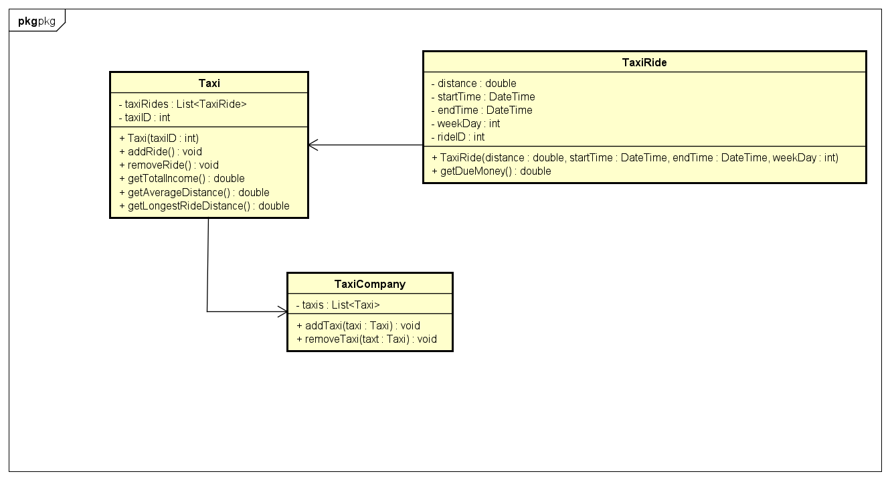
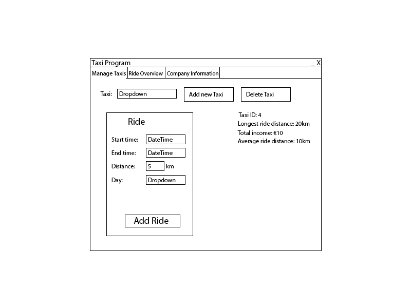
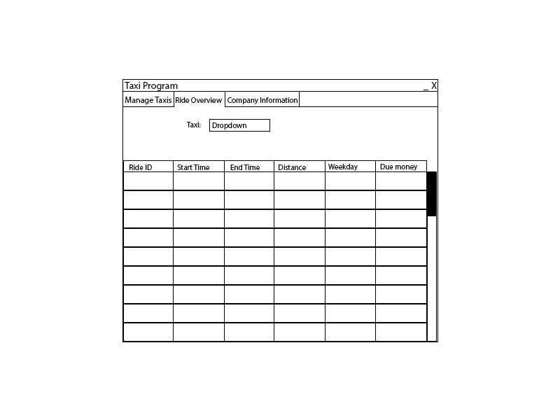
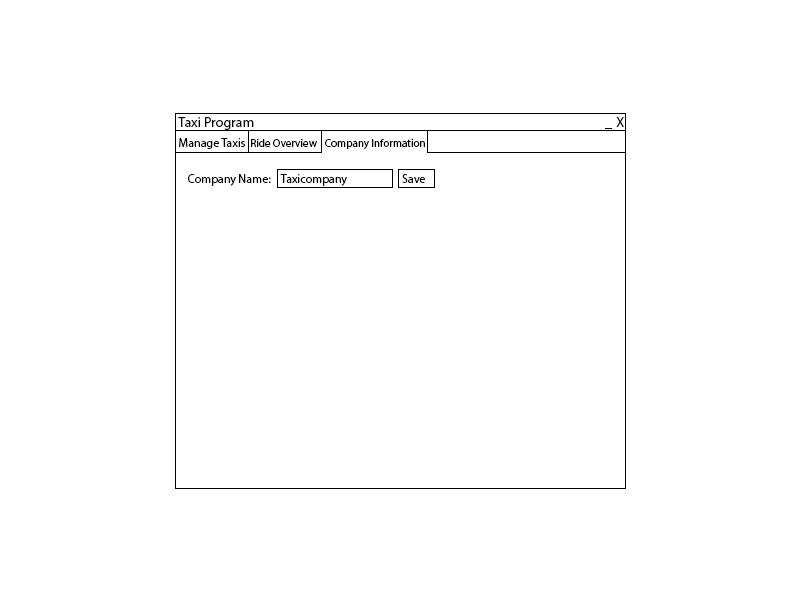

# Startdocument for the Taxi assignment

Startdocument of **Rick Vinke**. Student number **5035678**.

## Problem Description
A taxi company wants an application where the start and end time (formatted as hhmm),
weekday and distance can be entered.
For each trip, the amount of due money should be calculated and shown.
Furthermore, the total revenue, the average distance and the distance of the longest
trip should be shown.

The following tariffs should be maintained:
- € 0,50 per km ridden. 
- On top of the above: € 0,17 per minute ridden.
- From Friday night 10 p.m. to Monday morning 7 a.m., 
a surcharge of 15% applies. (the starting time is decisive for this)

### Input & Output

In this section the in- and output of the application will be described.

#### Input

In the table below all the input (that the user has to input in order to make the application work) are described.

| Case         | Type       | Conditions                                                                                   |
|--------------|------------|----------------------------------------------------------------------------------------------|
| Start Time   | `DateTime` | Cannot be empty. Only hours and minutes are changeable.                                  |
| End Time     | `DateTime` | Cannot be empty. Only hours and minutes are changeable. Cannot be before begin time. |
| Day          | `Enum`     | Cannot be empty.                                                                         |
| Distance     | `Double`   | Cannot be empty. Cannot be less than 0. Value must be in kilometers.                 |
| Company Name | `String`   | Cannot be empty.                                                                             |

#### Output

| Case                  | Type      | Description                                                                                          |
|-----------------------|-----------|------------------------------------------------------------------------------------------------------|
| Taxi ID               | `Integer` | The ID of the Taxi. Can be used to identify the Taxi.                                                |
| Ride ID               | `String`  | The ID of the TaxiRide. Can be used to identify the Ride.                                            |
| Start Time            | `String`  | The start time of the Ride. Is shown as a String.                                                 |
| End Time              | `String`  | The end time of the Ride. Is shown as a String.                                                   |
| Distance              | `Double`  | The distance of the ride, shows in kilometers.                                                       |
| Day                   | `String`  | The day of the Ride.                                                                                 |
| Due Money             | `Double`  | The money that still needs to be paid.                                                               |
| Average distance      | `Double`  | The average distance of all Taxi's of the TaxiCompany.                                               |
| Longest ride distance | `Double`  | The longest distance of all the rides of the Taxi's of the TaxiCompany.                              |

#### Calculations

| Case                  | Method                         | Calculation                                                                                                              |
|-----------------------|--------------------------------|--------------------------------------------------------------------------------------------------------------------------|
| Due money             | TaxiRide -> getDueMoney        | The money based on the begin and start time and the distance based on the tariffs in the first section of this document. |
| Average distance      | Taxi -> getAverageDistance     | The average of the distances of all TaxiRide objects in the Taxi.                                                        |
| Longest ride distance | Taxi -> getLongestRideDistance | Loop over all the TaxiRide objects of the Taxi to find the ride with the longest distance.                               |
| Total Income          | Taxi -> getTotalIncome         | The total income of the Taxi.                                                                                            |

## Class Diagram

## GUI drawing

## Testplan

| Input          |              |            |              | Output        |                  |                      |                      |            |
|----------------|--------------|------------|--------------|---------------|------------------|----------------------|----------------------|------------|
| **Start time** | **End time** | **Day**    | **Distance** | **Due money** | **Total Income** | **Average distance** | **Longest Distance** | Ride Count | 
| `13:00`        | `17:00`      | `Monday`   | `10`         | `45,80`       | `48,80`          | `10`                 | `10`                 | 1          |
| `16:00`        | `17:00`      | `Tuesday`  | `25`         | `22,70`       | `68,50`          | `17,5`               | `25`                 | 2          |
| `05:00`        | `08:00`      | `Monday`   | `5`          | `38,06`       | `106,56`         | `13,33`              | `25`                 | 3          |
| `23:00`        | `02:00`      | `Friday`   | `10`         | `40,94`       | `147,50`         | `12,5`               | `25`                 | 4          |
| `12:30`        | `14:00`      | `Saturday` | `30,5`       | `39,73`       | `187,23`         | `16,10`              | `30,5`               | 5          |

