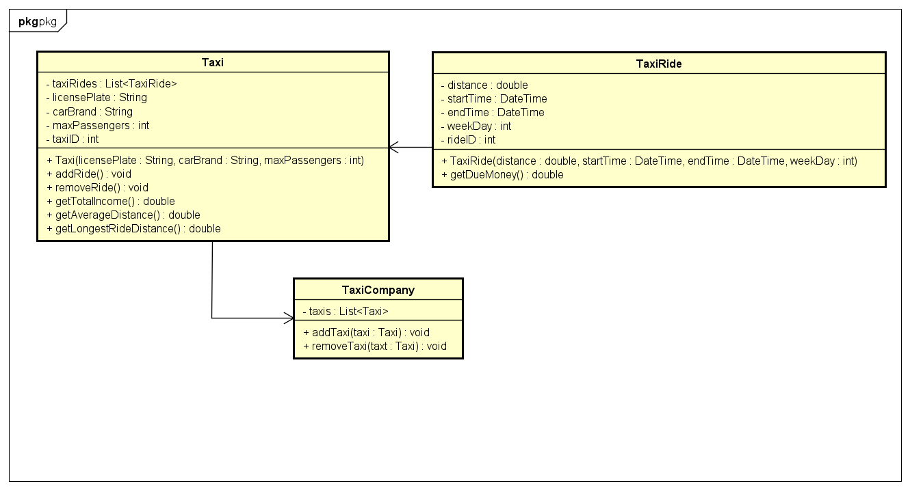
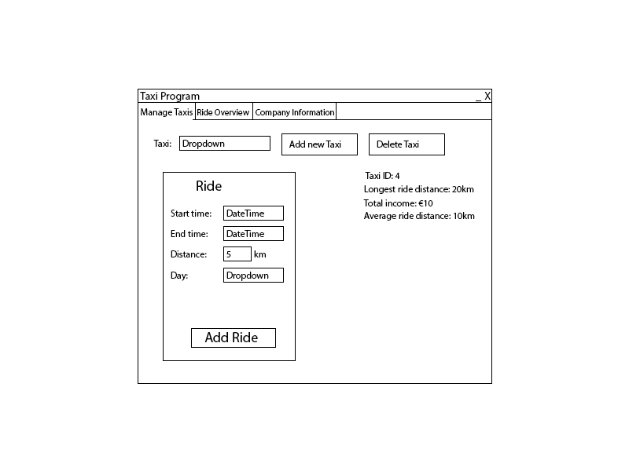
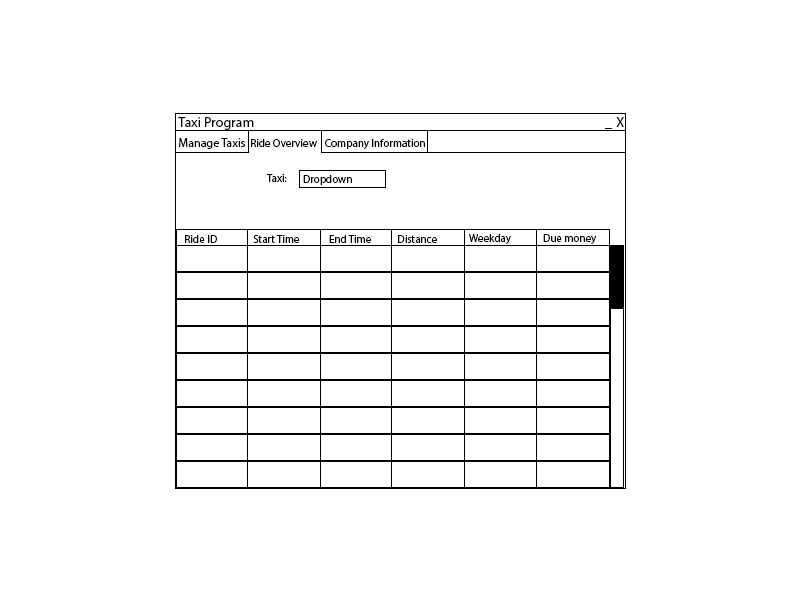
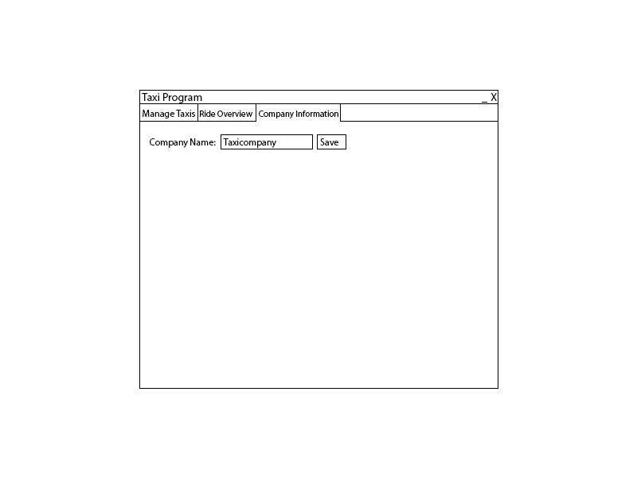

# Startdocument for the Taxi assignment

Startdocument of **Rick Vinke**. Student number **5035678**.

## Problem Description
A taxi company wants an application where the start and end time (formatted as hhmm),
weekday and distance can be entered.
For each trip, the amount of due money should be calculated and shown.
Furthermore, the total revenue, the average distance and the distance of the longest
trip should be shown.

The following tariffs should be maintained:
- € 0,50 per km ridden. 
- On top of the above: € 0,17 per minute ridden.
- From Friday night 10 p.m. to Monday morning 7 a.m., 
a surcharge of 15% applies. (the starting time is decisive for this)

### Input & Output

In this section the in- and output of the application will be described.

#### Input

In the table below all the input (that the user has to input in order to make the application work) are described.

| Case         | Type       | Conditions                                                                                   |
|--------------|------------|----------------------------------------------------------------------------------------------|
| Start Time   | `DateTime` | Cannot be empty. Only hours and minutes are changeable.                                  |
| End Time     | `DateTime` | Cannot be empty. Only hours and minutes are changeable. Cannot be before begin time. |
| Day          | `Enum`     | Cannot be empty.                                                                         |
| Distance     | `Double`   | Cannot be empty. Cannot be less than 0. Value must be in kilometers.                 |
| Company Name | `String`   | Cannot be empty.                                                                             |

#### Output

| Case                  | Type      | Description                                                                                          |
|-----------------------|-----------|------------------------------------------------------------------------------------------------------|
| Taxi ID               | `Integer` | The ID of the Taxi. Can be used to identify the Taxi.                                                |
| Ride ID               | `String`  | The ID of the TaxiRide. Can be used to identify the Ride.                                            |
| Start Time            | `String`  | The start time of the Ride. Is shown as a String.                                                 |
| End Time              | `String`  | The end time of the Ride. Is shown as a String.                                                   |
| Distance              | `Double`  | The distance of the ride, shows in kilometers.                                                       |
| Day                   | `String`  | The day of the Ride.                                                                                 |
| Due Money             | `Double`  | The money that still needs to be paid.                                                               |
| Average distance      | `Double`  | The average distance of all Taxi's of the TaxiCompany.                                               |
| Longest ride distance | `Double`  | The longest distance of all the rides of the Taxi's of the TaxiCompany.                              |

#### Calculations

| Case                  | Method                         | Calculation                                                                                                              |
|-----------------------|--------------------------------|--------------------------------------------------------------------------------------------------------------------------|
| Due money             | TaxiRide -> getDueMoney        | The money based on the begin and start time and the distance based on the tariffs in the first section of this document. |
| Average distance      | Taxi -> getAverageDistance     | The average of the distances of all TaxiRide objects in the Taxi.                                                        |
| Longest ride distance | Taxi -> getLongestRideDistance | Loop over all the TaxiRide objects of the Taxi to find the ride with the longest distance.                               |
| Total Income          | Taxi -> getTotalIncome         | The total income of the Taxi.                                                                                            |

## Class Diagram

## GUI drawing

## Testplan

### Testdata

#### TaxiRide

| Type       | Data    |
|------------|---------|
| Start time | `10:15`  |
| End time   | `11:20`  |
| Distance   | `11`     |
| Day        | `Tuesday` |

#### TaxiCompany

| Type       | Data    |
|------------|---------|
| CompanyName | `NHL Stenden` |

In this section the testcases will be described to test the application.
At the start of this testplan there should be no existing data in the database.

#### #1 Test Taxi creation.

Testing if the creation of Taxis and the input validation of the form is working correctly.

| Step | Input                                                                                   | Action                                                                                  | Expected output                                                                                     |
|------|-----------------------------------------------------------------------------------------|-----------------------------------------------------------------------------------------|-----------------------------------------------------------------------------------------------------|
| 1    |                                                                                         | Click on add new Taxi.                                                                  | A Taxi is added to the dropdown and the ID, distance and income information is listed on the right. |

#### #2 Test Ride form validation.

Testing if a ride can be added to a Taxi.

| Step | Input                                                                          | Action                                                                    | Expected output                                                                                      |
|------|--------------------------------------------------------------------------------|---------------------------------------------------------------------------|------------------------------------------------------------------------------------------------------|
| 1    |                                                                                | Click on Add Ride without any data entered in the form.                   | Popup saying that the input is required..                                                            |
| 2    | The TaxiRide test data but with a End time before the Start time.              | Enter a End time that is before the Start time.                           | Popup saying that the end time cannot be before the start time.                                      |
| 3    | The TaxiRide test data but with a letter instead of a number for the Distance. | Enter a letter instead of a number in the Distance field.                 | Popup saying that the distance should be a number.                                                   |

#### #3 Test adding TaxiRides.

Testing if a ride can be added to a Taxi.

| Step | Input                                                                          | Action                                                                       | Expected output                                                                                     |
|------|--------------------------------------------------------------------------------|------------------------------------------------------------------------------|-----------------------------------------------------------------------------------------------------|
| 1    |                                                                                | Check the current state of the Ride Overview tab.                            | The Ride Overview tab with no Taxi selected.                                                        |
| 2    | The ID of the added Taxi.                                                      | Select the Taxi from the dropdown.                                           | A empty table.                                                                                      |
| 3    |                                                                                | Go back to the Manage Taxi tab.                                              | The Manage Taxi menu.                                                                               |
| 4    | The ID of the added Taxi.                                                      | Select the previously created Taxi.                                          |                                                                                                     |
| 5    | The TaxiRide test data.                                                        | Fill in the correct test data for the Ride and press the Add Ride button.    | The input fields should become empty again and the Taxi information on the right should be updated. |
| 6    | The ID of the added Taxi.                                                      | Go back to the Manage Taxi tab and select the previously created Taxi again. | The Ride you just added in the table.                                                               |

#### #4 Test database saving and loading.

Test if the data is saved to the database and loaded correctly on startup.

| Step | Input                      | Action                                                                | Expected output                                           |
|------|----------------------------|-----------------------------------------------------------------------|-----------------------------------------------------------|
| 1    |                            | Go to the Company Information tab.                                    | The Company Information menu.                             |
| 2    | The TaxiCompany test data. | Change the company name to the value in the test data and press save. | A popup saying that the company name was saved correctly. |
| 3    |                            | Restart the application.                                              | The Manage Taxis tab.                                     |
| 4    | The ID of the added Taxi.  | Go to the Ride Overview and select the previously created Taxi.       | The previously added Ride is still listed in the table.   |
| 5    |                            | Go to the Company Information tab.                                    | The name of the company is still the changed value.       |

#### #5 Delete Taxi.

Test if deleting Taxis works correctly.

| Step | Input                     | Action                                         | Expected output                                                                                 |
|------|---------------------------|------------------------------------------------|-------------------------------------------------------------------------------------------------|
| 1    |                           | Go to the Manage Taxi tab.                     | The Manage Taxi menu.                                                                           |
| 2    | The ID of the added Taxi. | Select the existing Taxi.                      | The data on the right is filled with the data of the Taxi.                                      |
| 3    |                           | Click on the Delete Taxi button.               | The Taxi disappears from the dropdown and the data on the right return to their default values. |
| 4    |                           | Go to the Ride Overview click on the dropdown. | The Taxi should not be in the dropdown anymore.                                                 |
